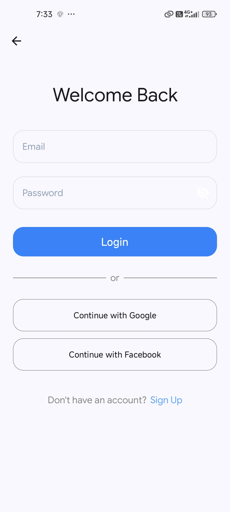
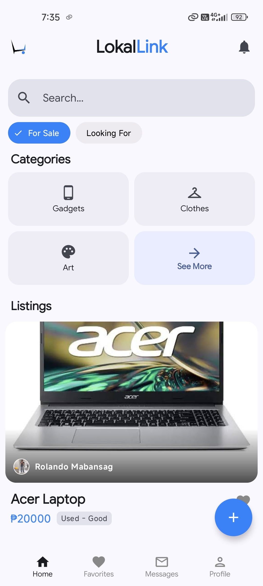
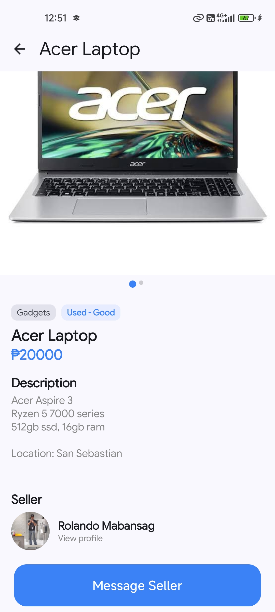
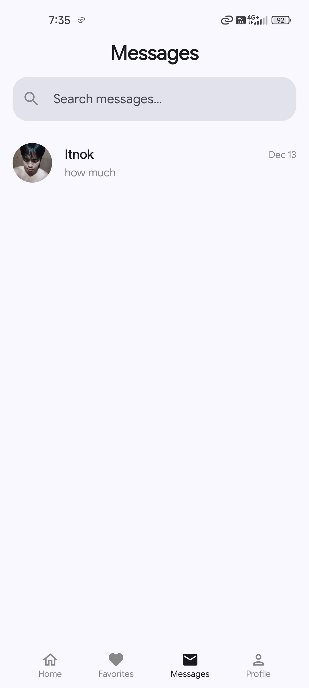
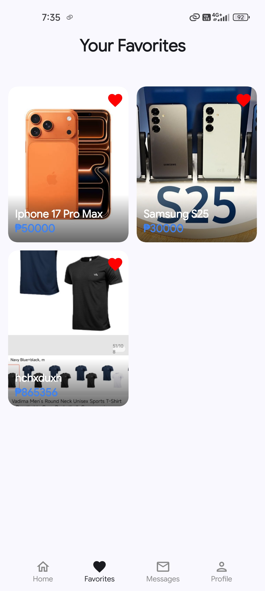

# LokalLink

**LokalLink** is an open-source Android marketplace application designed to facilitate localized buying and selling of second-hand and unused items. The app focuses on community-based transactions to improve convenience, trust, and sustainability.

By prioritizing nearby connections rather than global listings, LokalLink encourages faster meet-ups, clearer communication, and stronger local communities.

---

## Table of Contents
- [Overview](#overview)
- [Features](#features)
- [Tech Stack](#tech-stack)
- [Architecture](#architecture)
- [Screenshots](#screenshots)
- [Getting Started](#getting-started)
- [Configuration](#configuration)
- [Project Status](#project-status)
- [Roadmap](#roadmap)
- [Contributing](#contributing)
- [License](#license)
- [Author](#author)

---

## Overview

LokalLink provides a modern, simple mobile marketplace experience where users can:
- Post second-hand items for sale
- Discover nearby listings
- Communicate directly with sellers
- Arrange local meet-ups

The app is built using **Jetpack Compose** for UI, **Supabase** for storage, and **Firebase Realtime Database** for chat, ensuring a lightweight, maintainable, and scalable architecture.

---

## Features

- User authentication (email & password)  
- Create, edit, and manage item listings  
- Upload and manage item images  
- Category-based browsing  
- Search functionality  
- Location-focused listings  
- Real-time buyer–seller chat  
- Like / favorite items  
- User profile with listings  
- Mark items as sold  

---

## Tech Stack

### Frontend
- **Platform:** Android  
- **Language:** Kotlin  
- **UI Framework:** Jetpack Compose  

### Backend & Services
- **Supabase Storage** — Image and media storage  
- **Firebase Realtime Database** — Real-time chat system  
- **Firebase Authentication** — User authentication  

---

## Architecture

The application follows a **modular MVVM architecture**:

- **UI Layer:** Jetpack Compose screens and components  
- **State Management:** ViewModel  
- **Data Layer:**  
  - Supabase for image storage  
  - Firebase Realtime Database for messaging  
  - Firebase Authentication for user accounts  

This structure ensures **scalability, maintainability, and clean separation of concerns**.

---

## Screenshots

<p align="center">
  
  
  
  
</p>

<p align="center">
  
  
</p>

### Screen Overview
- **Login:** User authentication  
- **Home:** Browse local listings by category  
- **Item Details:** View item information and seller details  
- **Messages:** Real-time chat between buyers and sellers  
- **Favorites:** Saved items for easy access  
- **Profile:** Manage user information and listings  

---

## Getting Started

### Prerequisites
- Android Studio (latest stable version)  
- Android SDK 24+  
- Firebase project  
- Supabase project  

### Installation

1. Clone the repository:
   ```bash
   git clone https://github.com/your-username/LokalLink.git


